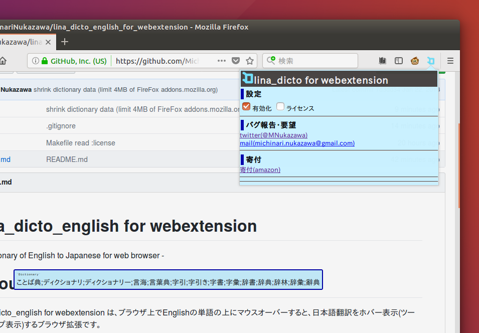

lina\_dicto\_english for webextension
====
\- Dictionary of English to Japanese for web browser -  

# About
lina\_dicto\_english for webextension は、ブラウザ上でEnglishの単語の上にマウスオーバーすると、日本語翻訳をホバー表示(ツールチップ表示)するブラウザ拡張です。  

本アドオンは、[lina\_dicto for webextension](https://github.com/MichinariNukazawa/lina_dicto_for_webextension) をEnglish版に改変したものです。  
また、[lina\_dicto\_english](https://github.com/MichinariNukazawa/lina_dicto_english) の一部を用いています。  
技術等の詳細はこれらを参照ください。  

# Screenshot/Image
  

# Get this
[Firefox Add-ons](https://addons.mozilla.org/ja/firefox/addon/lina_dicto_english_for_webextension/)  

# Build
## Package
`make package`  

# License
Clause-2 BSD License  
Exclude dictionary data.(辞書ファイルは辞書ファイル毎のライセンスに準じます)  

## 辞書データについて
外部の辞書データを改変し収録させて頂きました。感謝いたします。  
[辞書データのREADME](dictionary/english/README.md)参照。  

# Contact
mail: [michinari.nukazawa@gmail.com](mailto:michinari.nukazawa@gmail.com)  
twitter: [@MNukazawa](https://twitter.com/MNukazawa)  

Develop by Michinari.Nukazawa, in project "[daisy bell](https://daisy-bell.booth.pm/)".  

